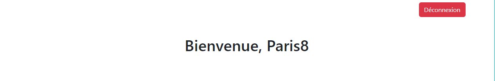

# Formulaire Securisé
Dans ce projet, on a utilise HTML pour la mise en page, BOOTSTAP pour le design de notre formulaire, JAVASCRIPT pour dynamiser les messages avec bootstrap, PHP pour gerer 
tous ce qui est les operations d'inscription et d'authentification de notre formulaire et MYSQL pour le stockage et l'administration de notre base de donnees.

## Détails sur la Structure

- **admin/**          : dossier administration des utilisateurs quthentifies
  - `indedx.php`      : Page d'accueil des utilisateurs authentifies

- **bootstrap-5.2.3/** 
  - **dist/** 
    - **css/**        : Dossier boostrap css pour le design
    - **js/**         : Dossier boostrap js pour la dynamisation

- **illustrations/**  : Illustration des resultats
  - `admin.png`       : Illustration de la page d'accueil une fois l'utilisateur d'authentifie.
  - `success.png`     : Illustration du message quant on s'est authentifier avec success.
  - `Failed.png`      : Illustration du message quant l'authentification a echoue.
  - `signUp.png`      : Illustration du message quant on creer un nouveau utilisateur.
  - `Already_use.png` : Illustration du message quant l'identifiant qu'on utilise existe deja.
  - `form.png`        : Illustration du formulaire de base.
    
- `index.html`        : Fichier de la structure de base du formulaire.
- `paris8.png`        : Logo du formulaire.
- `README.md`         : Fichier de documentation du projet.
- `script.js`         : Fichier js pour dynamiser les messages.
- `traitement.php`    : Fichier php pour la gestion des transactions avec la base de donnee.
- `users.sql`         : Fichier contenant la structure et les donnees de la base de donnees

## Utilisation
Le formulaire est compose de deux champs de texte un pour l'identifiant et l'autre pour le mot de passe et trois boutons, *Reinitialiser* pour effacer les champs de textes, *Se connecter* pour s'authentifier et *Ajout Compte*
pour ajouter un autre utilisateur dans la base de donnee.

## Visuels
Le formulairer de base se presente comme suit

Apres on a differents messages selon les resultats des actions qu'on a effectue sur le formulaire.
*Si on parvient a s'authentifier correctement sur le formulaire, on aura le message suivant:*

*Si on ne parvient pas aussi a s'authentifier on aura*

*On a aussi un message qui permet de confirmer si une inscription s'est reralise avec succes*

*Et un message qui permet de specififer qu'un identifiant est deja utilise pour eviter toute confusion des utilisateurs*

*Si l'utilisateur parviens à s'authentifier, il va etre rediriger dans cette page et il pourra appuyer sur le deconnexion pour se deconnecter*

## Informations de connexions
identifiant : Paris 8
Mot de passe : paris2024
