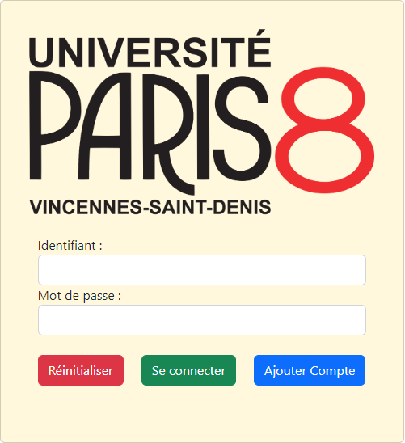
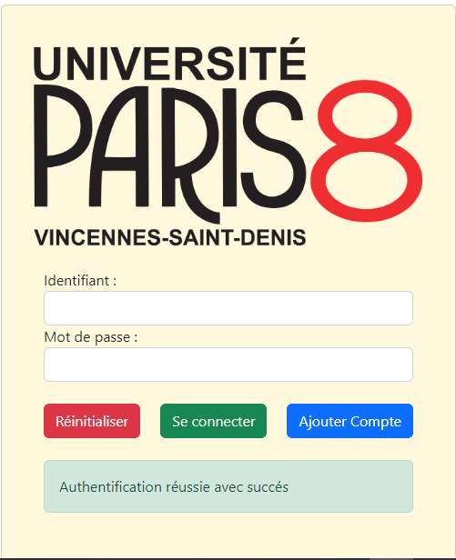
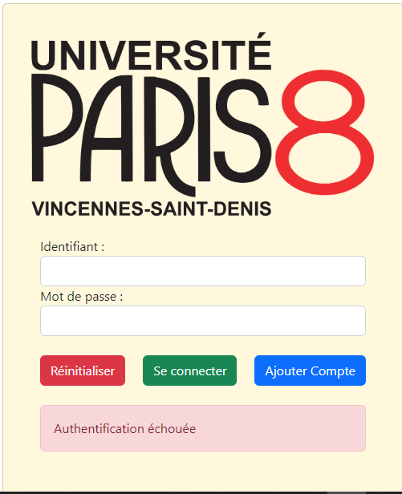
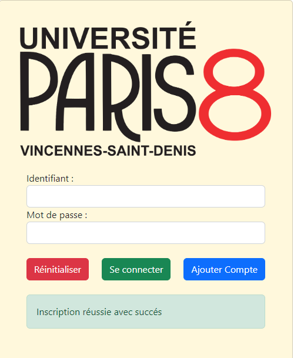
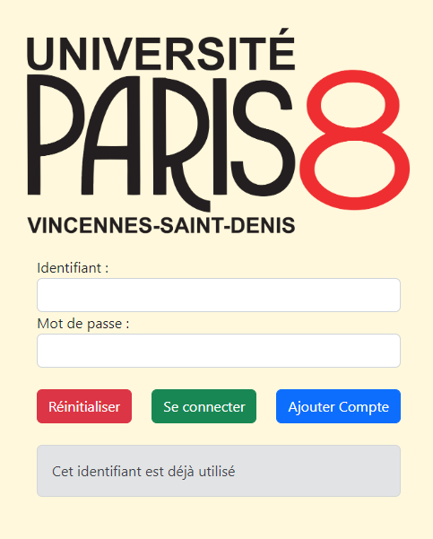

# Formulaire Securisé
Dans ce projet, on a utilise HTML pour la mise en page, BOOTSTAP pour le design de notre formulaire, JAVASCRIPT pour dynamiser les messages avec bootstrap, PHP pour gerer 
tous ce qui est les operations d'inscription et d'authentification de notre formulaire et MYSQL pour le stockage et l'administration de notre base de donnees.
## Utilisation
Le formulaire est compose de deux champs de texte un pour l'identifiant et l'autre pour le mot de passe et trois boutons, *Reinitialiser* pour effacer les champs de textes, *Se connecter* pour s'authentifier et *Ajout Compte*
pour ajouter un autre utilisateur dans la base de donnee.

## Visuels
Le formulairer de base se presente comme suit

Apres on a differents messages selon les resultats des actions qu'on a effectue sur le formulaire.
*Si on parvient a s'authentifier correctement sur le formulaire, on aura le message suivant:*

*Si on ne parvient pas aussi a s'authentifier on aura*

*On a aussi un message qui permet de confirmer si une inscription s'est reralise avec succes*

*Et un message qui permet de specififer qu'un identifiant est deja utilise pour eviter toute confusion des utilisateurs*

## Informations de connexions
identifiant : Paris 8
Mot de passe : paris2024
